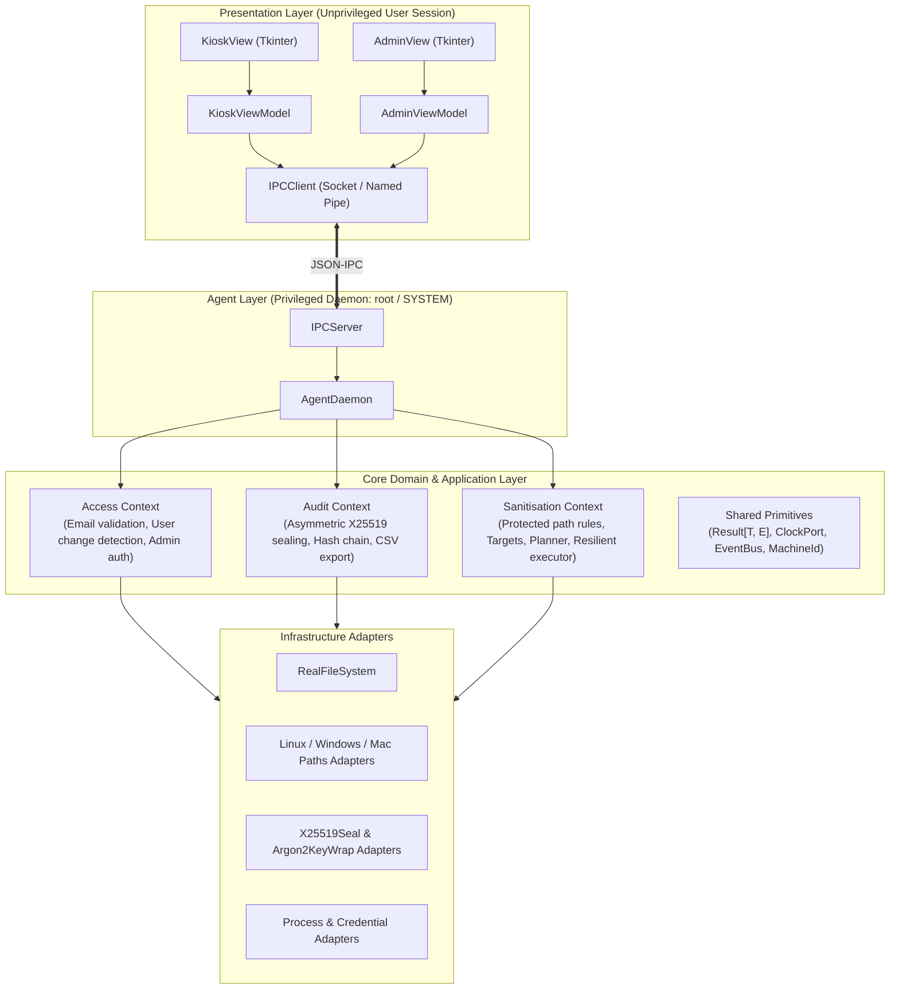

# AI Development Guide: Netejator98

Welcome, AI agent or human engineer! This document is designed to give you an immediate, high-fidelity mental model of **Netejator98**, its architectural constraints, invariants, and exact recipe for adding features or fixing bugs without breaking the system.

---

## 1. Quick Architectural Mental Model

Netejator98 is a cross-platform shared-PC sanitizer built with **strict Domain-Driven Design (DDD)** and **Hexagonal Architecture (Ports & Adapters)**.



### Two-Process Model
1. **Unprivileged Session UI**: Runs as the logged-in student user on desktop startup. Shows the frameless, always-on-top, non-closable kiosk prompt.
2. **Privileged Agent Daemon**: Runs as `root` (Linux/macOS) or `NT AUTHORITY\SYSTEM` (Windows). Listens on a local IPC socket / named pipe. Holds the X25519 public key to seal audit entries. Executes sanitisation with high privileges (terminating locked processes, wiping caches, unprotecting read-only files).

---

## 2. Inviolable Architectural Invariants

Whenever you write or modify code, you **MUST** respect these 5 core rules:

1. **Domain Isolation**: Code in `netejator98/*/domain/` **MUST NEVER** import from infrastructure, standard OS side-effects (`os`, `subprocess`, `platform`), or third-party frameworks. Domain logic must only interact via Ports (Protocols) and pure data classes.
2. **Result Type Over Exceptions**: All domain and application operations that can fail return `Result[T, E]` (`Ok[T]` or `Err[E]`). Do not raise uncaught exceptions across layer boundaries.
3. **Write-Only Audit Log**: The background daemon only has the `X25519` public key. It encrypts log payloads via libsodium `crypto_box_seal`. The private key is encrypted with Argon2id using the admin password and is **never** loaded in memory during regular student logins.
4. **Hash Chain Verification**: Every audit log entry in `audit.jsonl` contains the SHA-256 hash of the previous line: `hash = SHA256(prev_hash + ":" + ciphertext)`. Tampering can be verified offline by any auditor without entering any password.
5. **Protected Path Rule**: No cleaning pattern or runtime operation is ever allowed to match or delete OS directories (`/bin`, `/etc`, `C:\Windows`), root filesystem (`/`, `C:\`), or Netejator98 data directories (`/var/lib/netejator98`, `C:\ProgramData\netejator98`). Any attempt returns an error before touching disk.

---

## 3. Project Directory Map

```text
netejator98/
├── AI.md                              # This cheat sheet for AI agents
├── config.example.yaml                # Reference configuration
├── docs/
│   ├── ai-development-guide.md        # Extended developer guide
│   ├── user-guide.md                  # User & admin manual (Catalan/English)
│   ├── ubiquitous-language.md         # Domain terminology glossary
│   ├── architecture.md                # System architecture documentation
│   ├── privacy.md                     # GDPR/LOPD legal compliance notes
│   └── decisions/                     # Architecture Decision Records (ADRs 0001–0005)
├── packaging/                         # Systemd, Windows Service, Launchd, PyInstaller
├── policies/defaults/                 # Default YAML policies per OS (linux, windows, macos)
├── src/netejator98/
│   ├── access/                        # Bounded Context: User access & admin credentials
│   │   ├── domain/                    # InstitutionalEmail, Policy, Detector, Admin
│   │   ├── application/               # StartSession, AuthenticateAdmin, ChangePassword
│   │   └── infrastructure/            # Argon2PasswordHasher, FileAdminRepo, LastUserRepo
│   ├── audit/                         # Bounded Context: Cryptographic audit logging
│   │   ├── domain/                    # AuditEntry, SealedEntry, HashChain, AuditTrail
│   │   ├── application/               # RecordLogin, RecordSanitisation, QueryLog, ExportLog
│   │   └── infrastructure/            # X25519Adapter, KeyWrapAdapter, EncryptedJsonlRepo
│   ├── sanitisation/                  # Bounded Context: System cleaning & safety
│   │   ├── domain/                    # PathPattern, ProtectedPathRule, Policy, Planner, Plan
│   │   ├── application/               # DryRunUseCase, ExecuteSanitisationUseCase
│   │   └── infrastructure/            # RealFileSystem, OS path locators, ProcessAdapter
│   ├── agent/                         # Privileged Daemon & IPC Server
│   │   ├── protocol.py                # IPCRequest, IPCResponse, IPCCommands constants
│   │   ├── daemon.py                  # AgentDaemon orchestrator
│   │   └── ipc_server.py              # Cross-platform IPC server (Unix Domain Socket / Named Pipe)
│   ├── presentation/                  # Desktop GUI & Presentation
│   │   ├── i18n.py                    # Localization (Catalan 'ca', Spanish 'es', English 'en')
│   │   ├── view_models.py             # KioskViewModel, AdminViewModel (pure UI state)
│   │   ├── kiosk_view.py              # Tkinter frameless kiosk prompt
│   │   ├── admin_view.py              # Tkinter admin dashboard (Logs, Policy, Maintenance)
│   │   └── ipc_client.py              # IPC client communicating with daemon
│   ├── shared/                        # Primitives: Result, DomainError, Clock, EventBus, MachineId
│   ├── composition_root.py            # Dependency injection wire-up
│   └── main.py                        # CLI entry point ('ui', 'agent', 'verify-log', 'enable-daemon', 'disable-daemon')
└── tests/
    ├── fakes/                         # In-memory test doubles for ports
    ├── unit/                          # Isolated unit tests for domain & application layers
    └── integration/                   # Sandboxed filesystem & IPC integration tests
```

---

## 4. How to Implement Features (Recipes)

### Recipe A: Adding a New Cleaning Target Pattern
1. Open the default policy for the relevant OS in `policies/defaults/<os>.yaml`.
2. Add the target under `targets:`. For example:
   ```yaml
   - name: "VSCodeWorkspaces"
     category: "UserDocuments"
     patterns:
       - ".vscode/*"
   ```
3. If it requires dynamic path expansion (e.g. user home or browser profiles), check `src/netejator98/sanitisation/infrastructure/<os>_paths.py`.
4. Ensure the path is not prohibited by `ProtectedPathRule.DEFAULT_PROTECTED_PREFIXES` in `src/netejator98/sanitisation/domain/protected_path.py`.
5. Add an integration test in `tests/integration/test_sanitisation_sandbox.py`.

### Recipe B: Adding a New IPC Command
1. In `src/netejator98/agent/protocol.py`, add a command string constant to `IPCCommands`.
2. In `src/netejator98/agent/daemon.py`:
   - Add a dispatch branch in `AgentDaemon.dispatch(request)`.
   - Implement the handler method (calling an Application Use Case).
   - Return `IPCResponse.success(...)` or `IPCResponse.error(...)`.
3. In `src/netejator98/presentation/ipc_client.py`:
   - Add a client method that wraps `self.send_command(IPCCommands.YOUR_COMMAND, payload)`.
4. Update `KioskViewModel` or `AdminViewModel` to call the new client method.
5. Add a test in `tests/integration/test_ipc_protocol.py`.

### Recipe C: Adding a New Audit Event Type
1. In `src/netejator98/audit/domain/entry.py`, add the event name to `AuditEventType` (e.g. `NETWORK_DISCONNECT = "NETWORK_DISCONNECT"`).
2. In `src/netejator98/audit/application/`, either extend existing use cases or create a new use case following `RecordLoginUseCase`.
3. Verify serialization in `tests/unit/test_audit_domain.py`.

### Recipe D: Adding a New UI Language
1. Open `src/netejator98/presentation/i18n.py`.
2. Add the language code to `I18n.TRANSLATIONS` dictionary with all UI translation keys.
3. Test language switching in `tests/unit/test_presentation.py`.

---

## 5. Verification Commands

Run the full test suite anytime you touch code:
```bash
PYTHONPATH=src python3 -m unittest discover -s tests -v
```

Check code formatting / linting:
```bash
python3 -m pycodestyle src tests || true
```

Run Netejator98 locally for manual verification:
```bash
# Terminal 1: Run agent daemon with temporary storage
python3 -m netejator98.main agent --storage /tmp/test-netejator98

# Terminal 2: Run UI kiosk prompt
python3 -m netejator98.main ui
```

