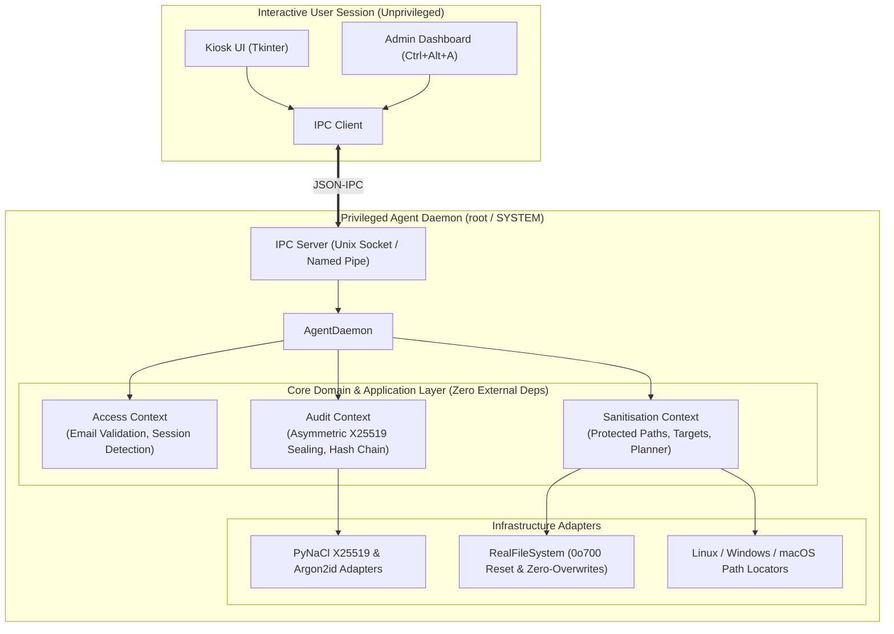

# Netejator98 🧹🖥️

[](https://github.com/insestatut/netejator98/actions/workflows/ci.yml)
[](https://www.python.org/)
[](LICENSE)
[](docs/architecture.md)

**Netejator98** is a lightweight, cross-platform shared-PC sanitizer designed for schools, loan laptops, and public computer labs. It guarantees that a student never inherits the previous student's browsing history, tokens, or files, while preserving a cryptographically sealed, tamper-evident audit trail of who used each workstation.

Built with **Domain-Driven Design (DDD)** and **Hexagonal Architecture (Ports & Adapters)** for Linux, Windows 10+, and macOS 12+.

---

## 🌟 Key Features

- 🛑 **Fullscreen Kiosk Lock**: Blocks the desktop on login with a frameless, always-on-top, non-closable prompt until the student enters their institutional email (`@insestatut.cat`).
- 🔄 **Smart User Change Detection**: Skips cleaning if the same student logs in again consecutively; triggers deep sanitisation immediately when a different student arrives.
- 🧹 **Cross-Platform Deep Sanitisation**:
  - Closes active browser processes gracefully.
  - Clears history, cookies, and caches for Google Chrome, Chromium, Mozilla Firefox, Microsoft Edge, Brave, Opera, and Safari (native, Snap, and Flatpak).
  - Empties personal user folders (Desktop, Documents, Downloads, Pictures, Videos, Music, Trash).
  - Purges shell history files (`.bash_history`, `.zsh_history`, PowerShell) and stored developer credentials (`.git-credentials`, GitHub CLI tokens).
- 🛡️ **Inviolable System Safety Invariants**: Strictly prohibits deletion of core OS files (`/bin`, `/etc`, `C:\Windows`), system roots, or Netejator98's own secure database.
- 🔐 **Asymmetric "Write-Only" Audit Log**:
  - The local background daemon holds only the **X25519 public key** (`crypto_box_seal`).
  - The private key is encrypted with **Argon2id** using the admin password and is never in memory during normal student sessions.
  - Even with root privileges, an attacker cannot decrypt past audit logs.
- ⛓️ **SHA-256 Tamper-Evident Hash Chain**: Every log entry includes `chain_hash = SHA256(prev_hash + ":" + ciphertext)`. Deletion, reordering, or tampering is detected mathematically offline without needing any password.
- 🔓 **Administrator Login Bypass**: Teachers and IT staff can bypass the student login screen directly with their admin password, unlocking the workstation instantly without cleaning any files.
- ⚙️ **Configurable Daemon State**: The background protection daemon is disabled by default for safe local testing and can be toggled on/off on demand via the Admin Dashboard or CLI (`enable-daemon` / `disable-daemon`).
- 🔑 **Emergency Admin Dashboard (`Ctrl+Alt+A`)**: Coordinators can view decrypted logs, verify chain integrity, edit cleaning policies (YAML), toggle daemon state, and export audit reports to CSV.
- 🌍 **Multilingual**: Catalan (default, `ca`), Spanish (`es`), and English (`en`).

---

## 🏗️ System Architecture

Netejator98 separates duties between an **unprivileged user desktop session** and a **privileged agent daemon** communicating over local IPC (Unix Domain Socket / Windows Named Pipe).



Read more in [`docs/architecture.md`](docs/architecture.md) and [`docs/decisions/`](docs/decisions/).

---

## ⚖️ Comparison with Windows SteadyState / Deep Freeze

| Feature / Property | Reboot-to-Restore (Deep Freeze, SteadyState) | Netejator98 |
| :--- | :--- | :--- |
| **Mechanism** | Kernel filesystem filter redirects writes to overlay cache; reboots discard overlay. | User-space / daemon deep sanitisation targeted at personal data and session state. |
| **Reboot Required?** | **Yes**. Workstation must fully reboot between students, taking 1–3 minutes. | **No reboot required**. Session change cleans in 1–3 seconds directly before unlocking. |
| **OS Updates & Patching** | Cumbersome. Requires scheduled maintenance windows to "thaw" the disk and freeze again. | Seamless. System updates and software installs apply normally without thawing. |
| **Audit Trail** | None. Completely unaware of who logged into the machine. | **Cryptographic write-only log** recording institutional student email and timestamps. |
| **Cross-Platform** | Typically Windows-only proprietary commercial software. | **Cross-platform** (Linux, Windows 10+, macOS 12+), free and open-source. |

---

## ⚠️ Non-Forensic Disclaimer

> [!CAUTION]
> **Important Security & Hardware Disclaimer**:
> Netejator98 is designed to prevent casual inspection, peer privacy breaches, and accidental exposure of student session data on shared school computers. It executes file unlinking, directory tree removal, and secure zero-overwriting (`shred`) on targeted files.
>
> However, on modern **solid-state drives (SSDs)** with wear-leveling controllers, or Copy-on-Write (CoW) filesystems (Btrfs, ZFS, APFS), software overwriting cannot guarantee physical elimination of flash blocks at the microscopic forensic level until TRIM and garbage collection cycles occur.
>
> **Recommendations for high-security environments**:
> - Combine Netejator98 with full-disk encryption (**LUKS**, **BitLocker**, or **FileVault**).
> - Enable BIOS/UEFI administrative passwords to prevent booting from external media.
> - For lab reimaging, pair with network PXE provisioning tools.

---

## 🚀 Quick Start for Developers

For AI coding agents and developers, read [`AI.md`](AI.md) and [`docs/ai-development-guide.md`](docs/ai-development-guide.md) first!

### 1. Prerequisites
- Python 3.10+
- `libnacl` / `libsodium` (usually pre-installed or bundled with `PyNaCl`)
- `tkinter` (`sudo apt-get install python3-tk` on Debian/Ubuntu)

### 2. Installation
```bash
git clone https://github.com/insestatut/netejator98.git
cd netejator98
python3 -m venv .venv
source .venv/bin/activate
pip install -e .
```

### 3. Running the Test Suite
```bash
PYTHONPATH=src python3 -m unittest discover -s tests -v
```

### 4. Running Locally in Dev Mode
```bash
# Terminal 1: Launch privileged agent daemon with scratch storage
python3 -m netejator98.main agent --storage /tmp/netejator98-dev

# Terminal 2: Launch user session kiosk UI
python3 -m netejator98.main ui
```
*Tip: Press `Ctrl+Alt+A` to set up the initial admin password or enter the admin dashboard.*

### 5. Building Standalone Executable (`build.py`)
To compile a single, zero-dependency self-contained executable for your current OS:
```bash
python build.py            # Generates dist/netejator98 (or dist/netejator98.exe on Windows)
```
- On **Windows**: outputs `dist\netejator98.exe`
- On **Linux**: outputs `dist/netejator98`
- On **macOS**: outputs `dist/netejator98`
- **GitHub Actions Multi-OS Builder**: Triggers automated builds across Linux, Windows, and macOS simultaneously in `.github/workflows/build-binaries.yml`.

---

## 📦 Deployment Guide for Sysadmins

See [`docs/user-guide.md`](docs/user-guide.md) for full screenshots and user workflows.

### Linux (Ubuntu / Debian / Arch / Fedora)
```bash
sudo ./packaging/linux/install.sh
```
This script:
1. Creates `/var/lib/netejator98` with `0700` permissions owned by `root:root`.
2. Installs default cleaning policy (`policies/defaults/linux.yaml`).
3. Registers and starts `netejator98-agent.service` via `systemd`.
4. Installs `/etc/xdg/autostart/netejator98-ui.desktop` for all desktop login sessions.

### Windows 10 & 11
Open PowerShell as **Administrator**:
```powershell
Set-ExecutionPolicy RemoteSigned -Scope Process
.\packaging\windows\install-service.ps1
.\packaging\windows\setup-logon-task.ps1
```

### macOS 12+ (Monterey, Ventura, Sonoma, Sequoia)
```bash
sudo ./packaging/macos/install.sh
```
This installs `/Library/LaunchDaemons/cat.insestatut.netejator98.agent.plist` and `/Library/LaunchAgents/cat.insestatut.netejator98.ui.plist`.

---

## 📚 Documentation Index

- [AI Development Guide](AI.md) — Architectural overview, invariants, and step-by-step recipes for AI coding agents.
- [User and Administrator Manual](docs/user-guide.md) — Complete guide for teachers, IT coordinators, and students.
- [System Architecture](docs/architecture.md) — Hexagonal DDD layers, sequence diagrams, and cryptographic design.
- [Ubiquitous Language Glossary](docs/ubiquitous-language.md) — DDD terminology shared across business and code.
- [Privacy & GDPR/LOPD Compliance](docs/privacy.md) — Legal bases, data minimization, and DPIA guidance.
- [Architecture Decision Records](docs/decisions/) — ADRs 0001 through 0005.

---

## 📜 License

Netejator98 is released under the [MIT License](LICENSE).
Developed for the educational community.

