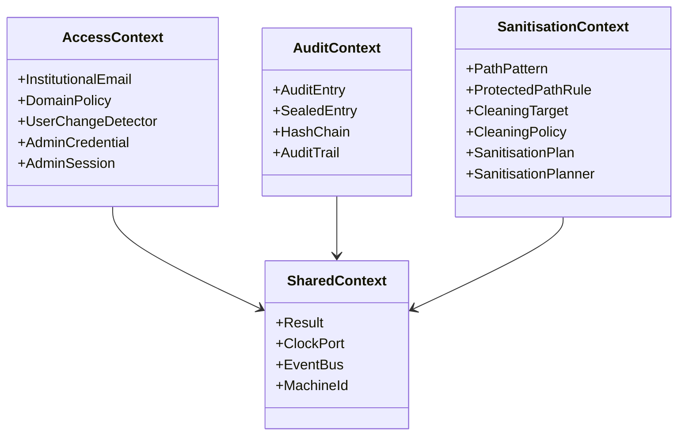

# Guia de Desenvolupament per a IA i Enginyers de Programari
*(AI & Software Engineer Architecture Guide)*

Aquest document és una referència tècnica exhaustiva per a assistents de codificació d'IA i desenvolupadors de programari que hagin de mantenir, estendre o refactoritzar **Netejator98**.

---

## 1. Filosofia de Disseny i Principis Rectors

Netejator98 s'ha construït seguint **Disseny Orientat al Domini (DDD)** i **Arquitectura Hexagonal (Ports i Adaptadors)**:

1. **Nucli de Domini Pur**: Totes les regles de negoci resideixen a `src/netejator98/*/domain/`. Aquestes carpetes tenen prohibit importar llibreries de tercers o mòduls natius d'efectes secundaris del sistema operatiu (`os`, `sys`, `subprocess`, `platform`).
2. **Ports com a Interfícies Abstractes**: La comunicació entre el domini/aplicació i l'exterior (disc, rellotge, processos, xarxa, criptografia de baix nivell) es realitza mitjançant **Ports** (`typing.Protocol` o classes abstractes).
3. **Adaptadors d'Infraestructura**: Les implementacions concretes resideixen a `src/netejator98/*/infrastructure/`. Cap capa interna depèn d'aquesta carpeta; s'injecten des del *Composition Root* o des del dimoni de l'agent.
4. **Tipus de Retorn Monàdic `Result[T, E]`**: El domini i els casos d'ús no llencen excepcions no controlades per a fluxos previstos d'error. Retornen `Ok(value)` o `Err(DomainError)`. Això fa que el flux de control sigui explícit i comprovable en temps de compilació/test.
5. **Seguretat per Defecte (Fail-Closed)**: Davant de qualsevol dubte en la validació de rutes o xifratge, l'aplicació avorta l'operació abans de posar en risc la integritat del sistema o la privadesa de l'estudiant.

---

## 2. Mapa dels Contextos Delimitats (Bounded Contexts)



### Context 1: Access (`src/netejator98/access`)
- **Objectiu**: Validar la identitat institucional de l'estudiant, detectar si hi ha hagut canvi d'usuari respecte a l'anterior sessió, i autenticar la sessió administrativa.
- **Entitats i Value Objects**:
  - `InstitutionalEmail`: Comprova sintaxi i el domini permès (`insestatut.cat`).
  - `DomainPolicy`: Llista de dominis autoritzats.
  - `UserChangeDetector`: Compara el hash salat de l'usuari actual amb l'anterior per determinar si cal forçar la neteja.
  - `AdminCredential`: Hash Argon2id de la contrasenya d'administrador.
  - `AdminSession`: Token de sessió amb caducitat (per defecte 15 minuts).
- **Invariants de Seguretat**:
  - L'adreça de correu de l'estudiant **mai s'emmagatzema en text pla** a `last_user.hash`. S'aplica un hash criptogràfic salat amb la clau de la màquina.

### Context 2: Audit (`src/netejator98/audit`)
- **Objectiu**: Generar un rastre d'auditoria xifrat de totes les sessions i neteges que no pugui ser alterat ni llegit localment sense la contrasenya d'administrador.
- **Entitats i Value Objects**:
  - `AuditEntry`: Model en memòria de l'esdeveniment (data UTC, tipus, correu, màquina, dades addicionals).
  - `SealedEntry`: Entrada serialitzada xifrada asimètricament (`ciphertext_b64`), identificador d'entrada, data, i hash SHA-256 enllaçat (`chain_hash`).
  - `HashChain`: Cadena criptogràfica: `H_n = SHA256(H_{n-1} + ":" + ciphertext_b64)`.
- **Criptografia emprada**:
  - **X25519 (`crypto_box_seal`)**: El dimoni de l'agent només manté la clau pública (`log_public.key`) a la memòria i al disc. Pot xifrar entrades contínuament sense tenir accés a la clau privada.
  - **Argon2id + SecretBox (`crypto_secretbox`)**: La clau privada X25519 s'emmagatzema xifrada (`log_private.enc`). Només es desxifra quan l'administrador introdueix la seva contrasenya per consultar o exportar registres.

### Context 3: Sanitisation (`src/netejator98/sanitisation`)
- **Objectiu**: Planificar i executar la neteja segura i resilient de fitxers, navegadors, credencials i historials sense tocar fitxers del sistema.
- **Entitats i Value Objects**:
  - `PathPattern`: Patró relatiu segur. Rebutja rutes absolutes, intents d'escalada de directori (`..`) i caràcters perillosos.
  - `ProtectedPathRule`: Llista d'invariants inviolables del sistema operatiu (`/`, `/bin`, `/usr`, `/etc`, `C:\Windows`, `/var/lib/netejator98`, etc.).
  - `CleaningPolicy`: Col·lecció de `CleaningTarget` (objectius de neteja agrupats per categories com `UserDocuments`, `BrowserData`, `TempAndCache`).
  - `SanitisationPlan`: Llista d'accions concretes calculades pel `SanitisationPlanner`.
  - `ExecuteSanitisationUseCase`: Executor resilient amb reintents i desbloqueig de permisos (mode `0o700` si cal).

---

## 3. Arquitectura de Dos Processos i Protocol IPC

Per evitar concedir privilegis de superusuari a la interfície d'usuari interactiva de l'estudiant:
- **UI Kiosk (`netejator98 ui`)**: S'executa a l'espai d'usuari estàndard de la sessió gràfica. No pot manipular fitxers d'altres usuaris ni alterar serveis del sistema.
- **Dimoni Privilegiat (`netejator98 agent`)**: S'executa com a servei del sistema (`root` a Linux/macOS, `NT AUTHORITY\SYSTEM` a Windows).
- **Canal IPC Local**:
  - A sistemes Unix (Linux, macOS): Unix Domain Socket a `/run/netejator98/agent.sock` (permisos `0666` amb directori pare protegit).
  - A Windows: Named Pipe `\\.\pipe\netejator98_agent`.

### Format dels Missatges IPC
Els missatges són documents JSON delimitats per salt de línia (`\n`):
```json
// Petició (Client -> Dimoni)
{
  "command": "START_SESSION",
  "payload": {
    "email": "estudiant@insestatut.cat"
  }
}

// Resposta (Dimoni -> Client)
{
  "success": true,
  "data": {
    "sanitised": true,
    "user_changed": true,
    "unlocked": true
  },
  "error": null
}
```

---

## 4. Patrons de Desenvolupament: Com Afegir Codi Nou

### Com afegir un nou Adaptador d'Infraestructura
1. Localitza el Port al domini o a la capa d'aplicació (p. ex. `src/netejator98/sanitisation/application/ports.py`).
2. Implementa una nova classe a la subcarpeta `infrastructure/` que compleixi el protocol.
3. Mai no facis que el domini importi la nova classe.
4. Crea una implementació de proves falses (Fake/Mock) a `tests/fakes/`.
5. Escriu tests unitaris utilitzant el Fake abans de provar l'adaptador real.

### Com gestionar Errors de Domini
1. Si un mètode pot fallar per motius de regles de negoci (p. ex. un email invàlid o un patró prohibit), defineix un error a `src/netejator98/shared/errors.py`.
2. Fes que la funció retorni `Result[T, DomainError]`.
3. Retorna `Err(DomainError("Missatge explicatiu"))` en comptes de llençar `raise`.
4. En el cas d'ús d'aplicació o al VM, utilitza el patró:
   ```python
   result = use_case.execute(...)
   if result.is_err():
       handle_error(result.error)
   else:
       handle_success(result.value)
   ```

### Com mantenir la Integritat de la Cadena de Hash
Si afegeixes o modifiques camps a `AuditEntry` o `SealedEntry`:
- Recorda que `chain_hash` depèn de `f"{prev_hash}:{ciphertext_b64}"`.
- Assegura't que `AuditEntry.to_json()` sigui determinista (`sort_keys=True`).
- No canviïs el format de serialització sense crear una estratègia de migració o un nou número de versió al protocol.

---

## 5. Estratègia de Proves i Tests Automatitzats

Tots els canvis han de comptar amb cobertura de tests seguint la piràmide:

1. **Tests Unitaris (`tests/unit/`)**:
   - Ràpids (< 1 segon per suite).
   - Sense accés a disc real ni xarxa. Utilitzen `tests/fakes/` i `FrozenClock`.
   - Cobreixen lògica de dominis, càlculs criptogràfics, validació de dominis i view models de presentació.
2. **Tests d'Integració (`tests/integration/`)**:
   - Utilitzen `unittest.TestCase` amb entorns aïllats en directoris temporals (`tempfile.TemporaryDirectory`).
   - Cobreixen el xifratge/desxifratge complet a disc, la detecció de manipulació a `audit.jsonl`, la sobreescriptura amb zeros (`shred`), i el protocol complet d'IPC client-servidor sobre sockets locals.

Execució completa de la bateria de proves:
```bash
PYTHONPATH=src python3 -m unittest discover -s tests -v
```

