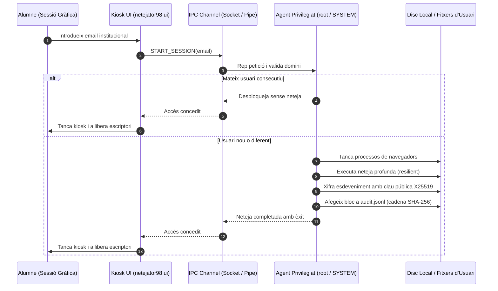
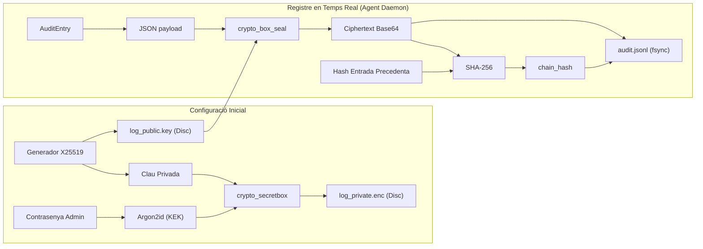

# Arquitectura del Sistema: Netejator98
*(System Architecture Document)*

Aquest document descriu l'arquitectura global de **Netejator98**, els patrons arquitectònics adoptats, la interacció entre processos i les decisions de disseny registrades (ADRs).

---

## 1. Visió General i Objectius

Netejator98 proporciona un entorn de sessió higiènic i auditable en ordinadors compartits d'instituts i centres educatius.

Els seus requeriments no funcionals crítics són:
1. **Seguretat de Privadesa**: Eliminació garantida de rastres d'alumnes anteriors abans que un nou alumne accedeixi a l'escriptori.
2. **Inviolabilitat del Registre**: Registre d'auditoria protegit matemàticament contra alteracions i lectures locals no autoritzades.
3. **Robustesa i Estabilitat**: Prevenció absoluta de danys al sistema operatiu o fitxers binaris essencials.
4. **Multiplataforma**: Suport homogeni a Linux, Windows 10+ i macOS 12+.

---

## 2. Model de Capes Hexagonal (Ports i Adaptadors)

Seguint el patró Hexagonal d'Alistair Cockburn i el Disseny Orientat al Domini (Eric Evans), el codi s'organitza en capes concèntriques amb regla de dependència estricta cap a l'interior:

```
+-------------------------------------------------------------+
|                     PRESENTATION / CLI                      |
|      (KioskView, AdminView, ViewModels, main.py CLI)        |
+-------------------------------------------------------------+
                              |
                              v
+-------------------------------------------------------------+
|                      APPLICATION USE CASES                  |
|    (StartSession, ExecuteSanitisation, RecordLogin, ...)    |
+-------------------------------------------------------------+
                              |
                              v
+-------------------------------------------------------------+
|                         CORE DOMAIN                         |
|   (InstitutionalEmail, CleaningPolicy, AuditTrail, etc.)    |
+-------------------------------------------------------------+
                              ^
                              |
+-------------------------------------------------------------+
|                    INFRASTRUCTURE ADAPTERS                  |
|   (RealFileSystem, X25519SealAdapter, EncryptedJsonlRepo)   |
+-------------------------------------------------------------+
```

### Contextos Delimitats (Bounded Contexts)
- **Access Context**: Validació de dominis institucionals, comparació d'usuaris previs, control de sessions d'administrador.
- **Audit Context**: Registre d'auditoria xifrat de forma asimètrica, verificació de cadenes de hash SHA-256 i exportació.
- **Sanitisation Context**: Definició d'invariants de seguretat, anàlisi de rutes, planificació i execució de neteja resilient.
- **Shared Context**: Primitives comunes (`Result[T, E]`, `ClockPort`, `EventBus`, `MachineId`).

---

## 3. Arquitectura de Processos i Comunicació IPC

Netejator98 utilitza un model de separació de privilegis en dos processos:



### Canal de Comunicació Local (IPC)
- **Linux / macOS**: Unix Domain Socket (`/run/netejator98/agent.sock`).
- **Windows**: Named Pipe (`\\.\pipe\netejator98_agent`).
- El canal utilitza framing per salts de línia (`\n`) amb documents JSON que segueixen `IPCRequest` i `IPCResponse`.

---

## 4. Esquema Criptogràfic d'Auditoria

L'objectiu és que l'ordinador pugui escriure en el fitxer de registre sense poder llegir-ne el passat ni manipular-lo.



### Propietats de Seguretat de l'Auditoria:
1. **Només Escriptura Asimètrica**: L'agent en segon pla només posseeix `log_public.key`. No pot desxifrar registres anteriors encara que sigui compromès.
2. **Encapsulament Anonymous (X25519 `crypto_box_seal`)**: Utilitza claus efímeres d'un sol ús per a cada entrada, garantint confidencialitat directa.
3. **Resistència a Manipulació (Hash Chain)**: Cada registre calcula `chain_hash = SHA256(prev_chain_hash + ":" + ciphertext)`. Qualsevol eliminació o modificació de línies fa fallar la verificació matemàtica.
4. **Independència de Verificació**: Qualsevol eina externa pot comprovar la integritat de la cadena de resums sense conèixer la contrasenya d'administrador ni desxifrar el contingut.

---

## 5. Decisions d'Arquitectura Registrades (ADRs)

Les decisions de disseny fonamentals es troben documentades a la carpeta [`docs/decisions/`](decisions/):

- **[ADR 0001: Hexagonal DDD Architecture](decisions/0001-hexagonal-ddd-architecture.md)**: Adopció de Domain-Driven Design pur, Ports i Adaptadors per desacoblar completament la lògica de negoci del sistema operatiu subjacent.
- **[ADR 0002: GUI Toolkit Selection](decisions/0002-gui-toolkit-selection.md)**: Elecció de Python standard `tkinter` per a una interfície nativa lleugera i sense dependències C pesades (com Qt) per facilitar la distribució escolar.
- **[ADR 0003: Asymmetric Audit Log Encryption](decisions/0003-asymmetric-audit-log-encryption.md)**: Ús de X25519 (`crypto_box_seal`) amb KEK derivat per Argon2id i cadena de resums SHA-256 per a un registre d'auditoria d'escriptura pura.
- **[ADR 0004: Privileged Agent IPC Separation](decisions/0004-privileged-agent-ipc-separation.md)**: Separació estricta entre la UI d'usuari no privilegiada i el servei dimoni privilegiat a través de sockets de domini Unix / Named Pipes.
- **[ADR 0005: Resilient Sanitisation Engine](decisions/0005-resilient-sanitisation-engine.md)**: Disseny del motor d'esborrat amb invariants estrictes de protecció del SO, reintents amb correcció de permisos i sobreescriptura segura.

